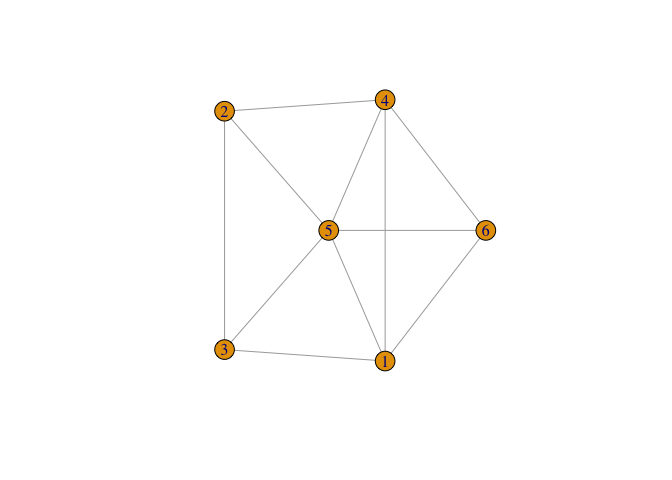
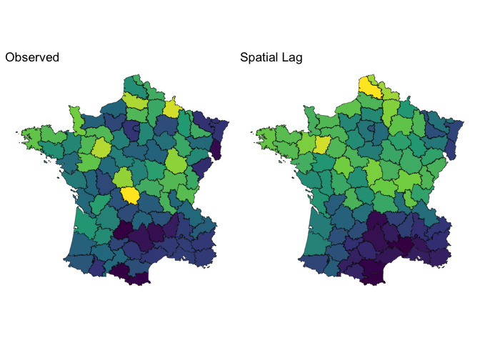

I’ve been saying this for years and I’ll say it again:

> *Spatial data is just a graph*

I’ve been diving *deep* into **Graph Neural Networks** (GNN) to
understand how we can use them for “GeoAI” and spatial machine learning.

This post is going to build the intuition for why Graph Neural Networks
are perfect for spatial data (non-raster).

## Spatial Weights Matrices are graphs

A graph is defined as a set **nodes** connected by **edges**. Nodes can
be thought of as “things” or “entities” and then the connections between
them are the edges. The nodes can be thought of as **rows** in a
dataset. Then the edges are an additional “edge list” that informs us of
connectivity between them.

``` r
library(igraph)

set.seed(0)
g <- sample_gnm(6, 11)
plot(g)
```

<!-- -->

When we do spatial statistics we need to create the concept of a
**neighborhood**. For example with polygons, we typically use
**contiguity** to define our neighborhood.

``` r
library(sf)
data(guerry, package = "sfdep")
plot(guerry$geometry)
```

<!-- -->

If we identify *neighborhoods* based on contiguity we then identify our
neighbors based on that which we use to create a **spatial weights
matrix**.

``` r
library(spdep)
nb <- poly2nb(guerry)
lw <- nb2listw(nb)
lw
```

    Characteristics of weights list object:
    Neighbour list object:
    Number of regions: 85 
    Number of nonzero links: 420 
    Percentage nonzero weights: 5.813149 
    Average number of links: 4.941176 

    Weights style: W 
    Weights constants summary:
       n   nn S0      S1       S2
    W 85 7225 85 37.2761 347.6683

<div class="aside">

The `listw` object from spdep is the representation of the spatial
weights matrix.

</div>

The spatial weights matrix is a **sparse matrix**. For every location in
our data set there is a row and a column—`n x n` matrix. A non-zero
value in a row indicates a neighbor. The connections between locations
(or the **spatial weights matrix** (SWM)) can be viewed as a network.

``` r
plot(nb, guerry$geometry)
```

<!-- -->

As you can see a spatial weight matrix **is a graph**!

<div class="aside">

To be exceptionally pedantic (as this whole post is) a SWM is a graph
*G* = (*V*, *E*) where each node, *v*<sub>*i*</sub>, is a location in a
set of nodes (*i* = 1, ..., *n*). The edges in the graph
*e*<sub>*i**j*</sub> = (*v*<sub>*i*</sub>, *v*<sub>*j*</sub>, *w*<sub>*i**j*</sub>)
are the spatial weights between neighbors.

</div>

Okay, moving on.

## Spatial Lags and Message Passing

The crux of spatial econometrics is the spatial lag. For all intents and
purposes, the spatial lag is “just” an average of a variable *X* over a
neighborhood.

<div class="callout-note">

See my [YouTube video](https://www.youtube.com/watch?v=abrQBSdTk7E) on
this in more depth.

</div>

``` r
library(dplyr)
library(sfdep)
library(ggplot2)
library(patchwork)

df <- guerry_nb |> 
  mutate(crime_lag = st_lag(crime_pers, nb, wt))

obs <- ggplot(df) +
  geom_sf(aes(fill = crime_pers)) +
  scale_fill_viridis_c() +
  theme_void() +
  theme(legend.position = "none") +
  labs(title = "Observed")

lagged <- ggplot(df) +
  geom_sf(aes(fill = crime_lag)) +
  scale_fill_viridis_c() +
  theme_void() +
  theme(legend.position = "none") +
  labs(title = "Spatial Lag")

obs | lagged
```

<!-- -->

<div class="callout-important">

## 👇🏽 Don’t miss this

👉🏼 The spatial lag is a way to **aggregate information** about a
location’s neighborhood. 👈🏼

</div>

GNNs are based on the concept of **message passing**. Message passing is
how we propagate information from a node’s neighbors (edge connections)
to the node itself.

``` r
# Create a simple 4-node network: central node with 3 neighbors
edges <- matrix(c(
  2, 1,  # node 2 -> central node
  3, 1,  # node 3 -> central node
  4, 1   # node 4 -> central node
), ncol = 2, byrow = TRUE)

g <- graph_from_edgelist(edges, directed = TRUE)

# Assign values to each node
node_values <- c(0.2, 0.8, 0.5, 0.9)

# Create layout: central node in middle, others in circle
layout <- matrix(c(
  0, 0,           # central node
  -1, 1,          # node 2
  -1, -1,         # node 3
  1, 0            # node 4
), ncol = 2, byrow = TRUE)

# Plot
plot(g,
  vertex.size = 30,
  vertex.color = rgb(node_values, 0, 1 - node_values),
  vertex.label = paste0("x", 1:4),
  vertex.label.cex = 1.2,
  vertex.label.font = 2,
  vertex.label.color = "white",
  edge.width = 2,
  edge.arrow.size = 1,
  edge.color = "gray50",
  layout = layout,
)
```

<!-- -->

In this graph, we have nodes x1 through x4. The nodes x2, x3, and x4 are
“passing” their message to the focal node. These node values have to be
summarized in some way. This is typically called an **aggregation
function**. The most common one? The average!

### The takeaway

The spatial lag operator **is message passing**! This means that most of
our spatial econometric models—spatial lag and spatial error models and
many others are actually utilizing graph message passing in some way.

## Graph Convolution Networks

The most common type of GNN is the **Graph Convolution Network** (GCN).

<div class="aside">

The term “Convolution” is often used for deep learning models that
perform image detection—typically a **Convolution Neural Network**.
These apply a “filter” over each pixel in an image and typically take
the weighted sum (or average) of the neighboring pixels to summarize
nearby pixels.

This is literally the same thing! Except pixels have a fixed grid
whereas we’re generalizing message passing and spatial lags to *any*
network with a node and neighbors.

</div>

The GCN is defined from a famous paper [Semi-Supervised Classification
with Graph Convolutional Networks](https://arxiv.org/abs/1609.02907) as:

$$
\mathbf{H}^{(k)} = \sigma\left(\tilde{\mathbf{A}}\mathbf{H}^{(k-1)}\mathbf{W}^{(k)}\right) 
$$

The single layer version of this can be written as:

$$
\mathbf{H} = \sigma\left(\tilde{\mathbf{A}} \mathbf{X} \mathbf{W}\right)
$$

This is actually a lot less scary once you think of everything as a
spatial lag and locations on a map. Let’s start with *Ã*.

### The adjacency matrix

$$
\tilde{\mathbf{A}} = (\mathbf{D} + \mathbf{I})^{-\frac{1}{2}}(\mathbf{I} + \mathbf{A})(\mathbf{D} + \mathbf{I})^{-\frac{1}{2}} 
$$

This equation is saying that we have an adjacency matrix *A* which is
“normalized” (scaled by) the **degree matrix** *D*. The degree matrix
counts the number of neighbors per location.

The matrix D is equivalent to `spdep::card(nb)`.

The biggest difference here between spatial econometrics and the GCN is
that the adjacency matrix *A* must have “self-loops.” The *I* + *A* is
equivalent to `spdep::include.self()`. This ensures that the
neighborhood includes the observed location.

<div class="aside">

*I* is called the “identity matrix.” It’s literally just the diagonal of
a matrix set to 1.

</div>

The point of this matrix is to ensure that when we multiply values
together the scale is roughly maintained and that the contribution from
neighbors **and** the focal node (location) are roughly balanced.

### The weights matrix *W*

The strength of neural networks is their ability to learn
representations of our variables—typically using a higher dimension
representation. For example, taking 3 variables and mapping them onto,
say, 3 “hidden” dimension would create a total of 9 values of *W* that
would be learned on. These embeddings can capture more patterns than
might be possible from the values themselves.


<div class="callout-note">

The rows of *W* correspond to the input variables. The columns indicate
the “hidden dimensions.” Multiplying by the *W* creates “node
embeddings.” The more hidden dimensions the more embedding variables
there are.

</div>

The matrix *W* is **learnable** which means that the network adjusts the
values to best predict the target variable *Y*. The *W* is akin to the
*β* coefficients of a regression model.

## Single layer GCN is just regression

In a regression we have a *β* for each variable in our model. If we have
3 variables in our *X* matrix (the predictor variables) and we specify
that our single layer model only have 1 hidden dimension then the *W*
only has 3 values—one per variable. This is essentially a learned
version of the *β*!


In this example we only have 1 hidden dimension which means we only have
1 weight per variable—akin to the actual *β* of a linear regression.
Now, this is actually ignoring the message passing aspect of this. To be
a GCN we need to calculate the spatial lag of each X before we multiply
by the learned weights. The actual GCN looks like


For the spatial econometricians in the house—this might look like a
spatially lagged X model without the original X matrix.

<div class="aside">

See [Spatial Data Science ch 17 on econometric
models](https://r-spatial.org/book/17-Econometrics.html) for a fairly
terse discussion on these models by Bivand and Pebesma.

</div>

Let’s first create a spatially lagged X model by hand:

``` r
# Create neighborhood structure with self-loops
nb <- include.self(guerry_nb$nb)
lw <- spdep::nb2listw(nb, style = "W")

# Prepare feature matrix
x <- guerry |>
  sf::st_drop_geometry() |>
  select(commerce, crime_pers, donations) |>
  scale()

# calculate spatial lags for each variable
sp_lags <- lag.listw(lw, x)

# define y variable
y <- guerry$instruction

# fit slx model
slx_mod <- lm(y ~ sp_lags)
summary(slx_mod)
```


    Call:
    lm(formula = y ~ sp_lags)

    Residuals:
       Min     1Q Median     3Q    Max 
    -45.22 -11.60   0.38  11.55  35.09 

    Coefficients:
                Estimate Std. Error t value Pr(>|t|)    
    (Intercept) 43.64726    1.93599  22.545  < 2e-16 ***
    sp_lags1    24.27125    2.92102   8.309 1.84e-12 ***
    sp_lags2    -1.06314    3.23981  -0.328    0.744    
    sp_lags3     0.09644    3.84151   0.025    0.980    
    ---
    Signif. codes:  0 '***' 0.001 '**' 0.01 '*' 0.05 '.' 0.1 ' ' 1

    Residual standard error: 17.75 on 81 degrees of freedom
    Multiple R-squared:  0.5086,    Adjusted R-squared:  0.4904 
    F-statistic: 27.95 on 3 and 81 DF,  p-value: 1.663e-12

If we treat the regression coefficients as our *W* matrix in a GCN layer
we can get the *exact* same values from a GCN layer!

Here we’re using my
[`{torchgnn}`](https://github.com/josiahparry/torchgnn) package to
create a `layer_gcn()`.

<div class="aside">

`{torchgnn}` is not yet on CRAN. You can install it with
`pak::pak("josiahparry/torchgnn")`.

</div>

``` r
library(torch)
library(torchgnn)

# Create sparse adjacency matrix for GCN
adj <- adj_from_edgelist(
  rep.int(seq_along(nb), lengths(nb)),
  unlist(nb),
  unlist(lw$weights), 
  # already handled by spdep
  symmetric = FALSE
)$coalesce()

# convert X to a tensor for torch
X <- torch_tensor(x)

# don't modify the adjacency matrix
layer <- layer_gcn(3, 1, normalize = FALSE)

# set the weights to the same as a the regression
with_no_grad({
  layer$weight$copy_(torch_tensor(matrix(coef(slx_mod)[-1], nrow = 3)))
})
```

    torch_tensor
     24.2712
     -1.0631
      0.0964
    [ CPUFloatType{3,1} ][ requires_grad = TRUE ]

``` r
# set the bias to the intercept
with_no_grad({
  layer$bias$copy_(torch_tensor(coef(slx_mod)[1]))
})
```

    torch_tensor
     43.6473
    [ CPUFloatType{1,1} ][ requires_grad = TRUE ]

In the above code check we created a single GCN layer and manually set
the bias (equivalent to an intercept term) and the weights. Typically
these would be learned by a training loop. But for the sake of
education, we’re setting them to be the equivalent to our linear
regression.

Next we apply the layer to the *X* and *A* matrices to get our *Ŷ*
predictions.

``` r
tibble::tibble(
  gcn_preds = as.numeric(layer(X, adj)),
  slx_preds = unname(slx_mod$fitted.values)
)
```

    # A tibble: 85 × 2
       gcn_preds slx_preds
           <dbl>     <dbl>
     1     47.9      47.9 
     2     18.1      18.1 
     3     64.9      64.9 
     4     46.5      46.5 
     5     52.0      52.0 
     6     49.4      49.4 
     7      6.78      6.78
     8     45.5      45.5 
     9     10.9      10.9 
    10     44.1      44.1 
    # ℹ 75 more rows

## Fuller GCN models

In the above we showed that the GCN layer is literally just a fancy
regression model using the spatial lags of our input variables. However,
we assumed that there was not any [activation
function](https://en.wikipedia.org/wiki/Activation_function).

For fuller examples we can fit a GCN with multiple hidden layers as well
as an additional activation or loss functions. These GCN models can
generalize well to classification or regression.
